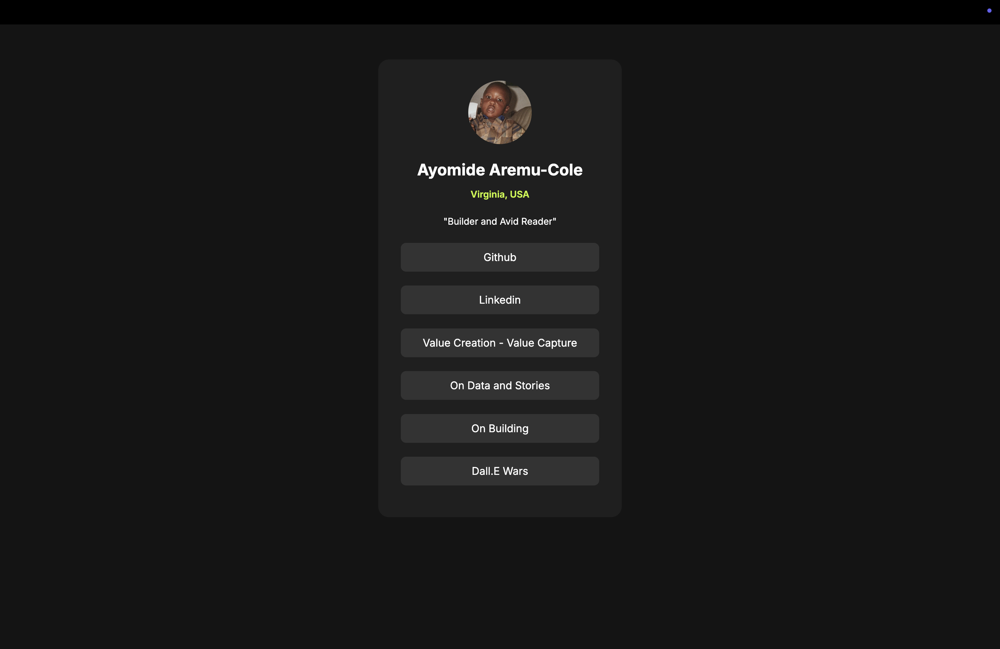

# Social Links Profile

This is a solution to the [Blog Preview Card challenge on Frontend Mentor](https://www.frontendmentor.io/challenges/blog-preview-card-ckPaj01IcS). Frontend Mentor challenges help improve coding skills by building realistic projects.

## Table of Contents

- [Overview](#overview)
  - [Screenshot](#screenshot)
  - [Links](#links)
- [My Process](#my-process)
  - [Built With](#built-with)
  - [Useful Resources](#useful-resources)

## Overview

### Screenshot

### Links

- Live Site URL: [Social Links Profile](https://blog-preview-component10.netlify.app/)

## My Process

### Built With

- Semantic HTML5 markup
- CSS custom properties
- Flexbox
- Mobile-first workflow
- [Codeium Cascade](https://codeium.com/cascade) - AI pair programming assistant

### Useful Resources

- [Codeium Cascade](https://codeium.com/cascade) - After the initial design, I used Cascade to refine and polish the implementation.
